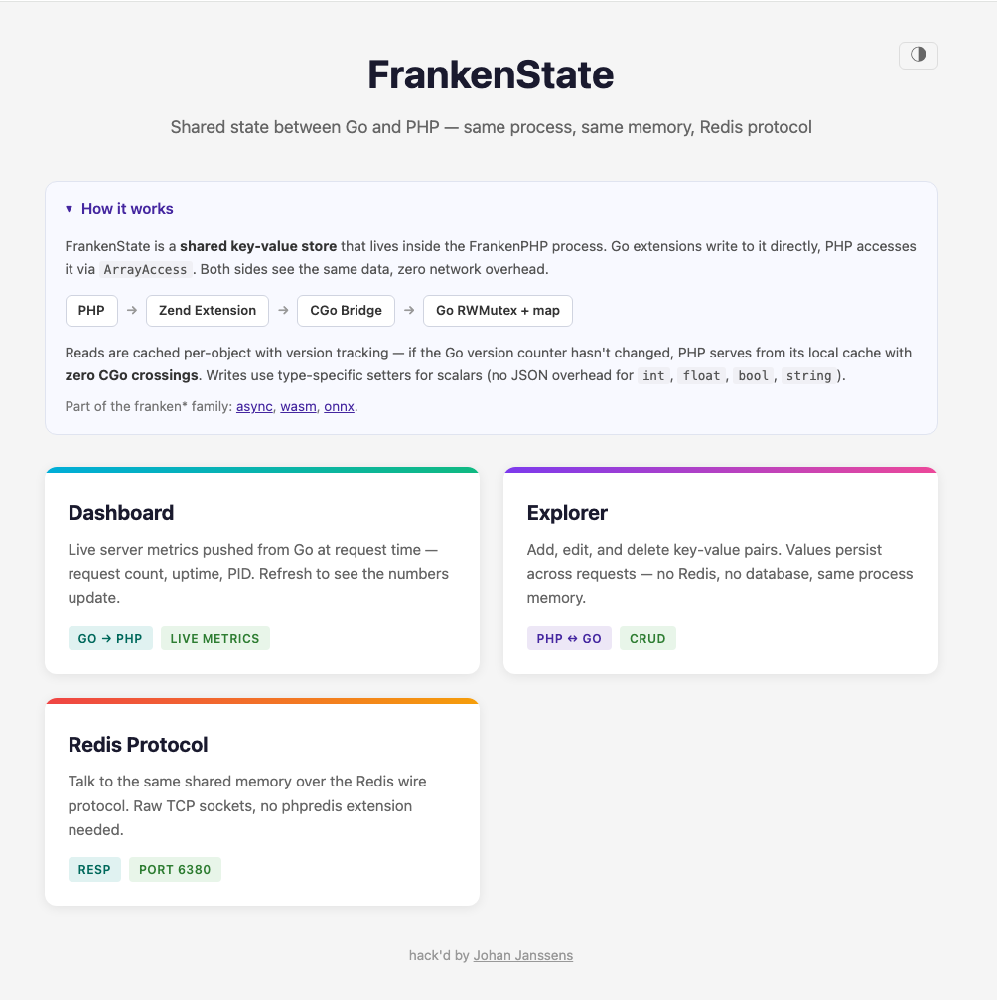

# FrankenState

Shared state between Go and PHP — an in-process key-value store with Redis wire protocol support, powered by [FrankenPHP](https://frankenphp.dev).

Go extensions write directly to a shared `map[string]any`. PHP reads and writes via `ArrayAccess`. Both sides see the same data, same process, zero network overhead. Reads that hit the version-gated cache cost zero CGo crossings.

> **Note**: This is a companion repo for my FrankenPHP conference talks. It's meant as inspiration and a reference implementation, not a production framework. Feel free to explore, fork, and adapt the patterns for your own projects. Links to talks and slides will be added here.

### Talks

No talks yet — but here's the abstract if you want to present this:

> **Shared State Between Go and PHP**
>
> What if PHP and Go could share memory — no Redis, no serialization, no network hop? With FrankenState and FrankenPHP, a Go extension writes to a shared map and PHP reads it via `$state['key']`. Same process, same memory. Cached reads cost zero CGo crossings. Scalar writes skip JSON entirely.
>
> This talk shows how to build a bidirectional Go ↔ PHP communication channel inside FrankenPHP, why in-process state changes the architecture of PHP applications, and how shared memory eliminates an entire class of infrastructure.

See [talk.md](talk.md) for the full narrative, demo walkthrough, and architecture breakdown.



## How It Works

```
Go Extension                    Shared Store                    PHP Thread
┌──────────────────┐           ┌──────────────────┐           ┌──────────────────┐
│ state.Set(k, v)  ├──────────►│ RWMutex + map    │◄──────────┤ $s['key'] = val  │
│ v = state.Get(k) │◄──────────┤ version tracking │──────────►│ $v = $s['key']   │
└──────────────────┘  direct   └──────────────────┘  CGo/JSON └──────────────────┘
     (zero overhead)                                     (cached, version-gated)
```

FrankenPHP embeds PHP in a Go process — they share the same address space. A Go `map[string]any` protected by `sync.RWMutex` is all you need. The C extension caches the full snapshot on each PHP object and gates refreshes on an atomic version counter.

## Quick Start

### Docker (recommended)

```bash
docker build -t frankenstate .
docker run -p 8083:8083 frankenstate
```

Open `http://localhost:8083` to see the demos.

The PHP build stage uses [static-php-cli](https://github.com/crazywhalecc/static-php-cli) which can download pre-built libraries from GitHub. Pass a GitHub token to speed up the build:

```bash
GITHUB_TOKEN=$(gh auth token) docker build \
    --secret id=github_token,env=GITHUB_TOKEN \
    -t frankenstate .
```

### Build & Run

```bash
make php        # Build PHP 8.3 (ZTS, embed) via static-php-cli (one-time)
make env        # Generate env.yaml with CGO flags from the PHP build
make run        # Build the binary + start the server on :8083
```

The PHP build is cached in `build/.php/` — subsequent runs skip the build if `libphp.a` exists. To rebuild PHP from scratch:

```bash
make php-clean  # Remove cached downloads and build artifacts
make php        # Rebuild
make env        # Regenerate env.yaml
```

### GoLand

Install the [EnvFile](https://plugins.jetbrains.com/plugin/7861-envfile) plugin, then in your Run Configuration enable EnvFile and add `env.yaml` to load the CGO flags automatically.

### Environment Variables

| Variable | Default | Description |
|---|---|---|
| `FRANKENSTATE_PORT` | `8083` | HTTP server port |
| `FRANKENSTATE_REDIS_PORT` | `6380` | RESP server port (Redis wire protocol) |
| `FRANKENSTATE_DOC_ROOT` | `examples` | PHP document root directory |
| `FRANKENSTATE_THREADS` | `2` | Number of PHP threads |

## Demos

| Demo | Description |
|------|-------------|
| **Dashboard** | Live server metrics pushed from Go — request count, uptime, PID, threads |
| **Explorer** | CRUD key-value browser with cross-request persistence |
| **Redis** | Same store accessed over RESP — raw TCP, no phpredis needed |

## Go API

Any Go extension can import the state package:

```go
import "github.com/johanjanssens/frankenstate/state"

state.Set("model.status", "loaded")
state.Set("config", map[string]any{"debug": true})

val, ok := state.Get("model.status")
state.Merge(map[string]any{"a": 1, "b": 2})
state.Replace(map[string]any{"fresh": "data"})
snap := state.Snapshot()
ver := state.Version()
```

## PHP API

```php
use FrankenPHP\SharedArray;

$state = new SharedArray();

// ArrayAccess
$state['key'] = 'value';
$val = $state['key'];
isset($state['key']);
unset($state['key']);

// Countable + IteratorAggregate
count($state);
foreach ($state as $key => $value) { ... }

// Bulk operations
$state->merge(['key1' => 'val1', 'key2' => 'val2']);
$old = $state->replace(['fresh' => 'data']);
$state->keys();
$state->snapshot();
$state->version();
```

## Project Structure

```
frankenstate/
├── main.go              # HTTP server + FrankenPHP init + request metrics
├── state/
│   └── state.go         # Go backend — RWMutex + map + version tracking
├── resp/
│   └── server.go        # Redis wire protocol (RESP) server
├── phpext/
│   ├── phpext.c         # Zend extension — module lifecycle
│   ├── phpext.h         # Module declarations
│   ├── phpext.go        # CGo exports (registered via init())
│   ├── phpext_cgo.h     # CGo header binding
│   ├── state.c          # FrankenPHP\SharedArray class
│   └── state.h          # Class declarations + arginfo
├── examples/            # PHP demo pages
│   ├── index.php        # Landing page with card grid
│   ├── dashboard/       # Live Go metrics
│   ├── explorer/        # CRUD key-value browser
│   └── redis/           # RESP round-trip demo
├── build/php/           # PHP build system (static-php-cli)
├── Dockerfile
├── Makefile
└── go.mod
```

## Requirements

- Go 1.26+
- [FrankenPHP](https://frankenphp.dev) (built automatically via `make php`)
- macOS, Linux, or Windows

## Family

Part of the franken\* family — FrankenPHP extensions written in Go:

- [frankenasync](https://github.com/johanjanssens/frankenasync) — parallel PHP subrequests
- [frankenwasm](https://github.com/johanjanssens/frankenwasm) — WASM plugins via Extism
- [frankenonnx](https://github.com/johanjanssens/frankenonnx) — ONNX inference
- [frankenwails](https://github.com/johanjanssens/frankenwails) — native desktop apps with PHP

## License

Code is MIT — see [LICENSE.md](LICENSE.md). The [talk material](talk.md) is licensed under [CC BY 4.0](https://creativecommons.org/licenses/by/4.0/) — free to share and adapt with attribution.
